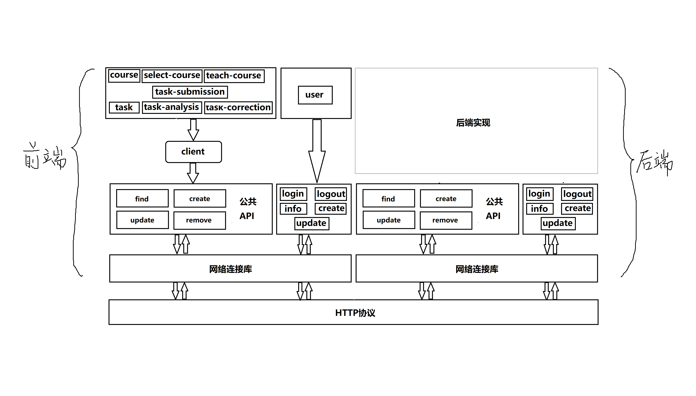

	<h3>作业批改系统文档</h3>
	

        古文奇、李皓瑞、范宏佳、落桑加措
    

#### 任务分工
- 古文奇：负责协调项目以及搭建前端框架

- 李皓瑞：负责搭建后端框架

- 范宏佳：负责前端页面编写

- 落桑加措：负责查重算法的研究与实现

  

#### 设计思路

  **1、将所有数据库表抽象成操作对象（服务），前后端分离开发**

  **2、在操作对象之上定义了以下四种接口（基于HTTP）：**
  - create: 创建对象

  - update：更新对象

  - remove：删除对象

  - find：查询特定条件的对象
    

**3、对于特殊操作对象user定义了以下五种接口（基于HTTP）：**

  - login：登录操作

  - logout：登出操作

  - info：获取user信息操作

  - create：创建user操作

  - update：更新user信息操作

#### API使用规定
  **公共API**
  - request
    - 负载为json格式，举个栗子：
    
      POST http://localhost:80/course/find，负载为{ data：{ a:1，b:2，... } }
  
  - 除了remove是使用HTTP协议的delete方法外，公共API中其他接口都是使用HTTP协议的post方法
  
  - response
    - 负载为json格式，要同时返回状态码和数据，当成功时返回数据或者成功消息，出错时返回出错原因，举个栗子：

      { code： 20000， data: { ... }}

      { code： 20000， data: “success” }

      ...

    - 状态码分为这几种：

      20000：成功

      50008：非法token

      50012：已在其他客户端登录
    
      50014：token过期
    
      其他状态码：其他自定义错误

  **特殊API**
  - request
    - login：同公共API
    - info：params的值为json，具体内容为{ token：“specified token” }
    - logout：使用HTTP协议的POST方法，参数为空
    - create、update：同公共API
  - response
    - login：返回空
    - logout：返回空
    - info：返回user除密码外的数据 
    - create、update：同公共API

#### 技术选型

  **1、业务分析**

​	作业批改系统要求老师能创建课程并能对不同课程布置作业同时管理学生，而学生需要能在系统上选择课程并完成老师所布置的作业

  **2、技术点分析**

​	由业务分析可知，该系统对不同的角色具有不同的功能和不同的页面，因此是一个根据角色给定不同的权限和页面的系统。而对于后台来说，对高并发的需求并不是很高，因此在技术上没有那么高要求。但是整个系统的突出的特点是作业查重这个点，因此后台的设计重点在于查重算法的实现。

  **3、技术选型**

​	由之前的开发经验，前端决定选择<a href="https://panjiachen.github.io/vue-element-admin-site/zh/guide/">vue-element-admin</a>框架进行开发，这个框架是基于<a href="https://cn.vuejs.org/index.html">vue.js</a>和<a href="https://element.eleme.cn/#/zh-CN">element-ui</a>开发，能够根据用户所拥有的角色分配权限，从而对路由以及组件进行动态的分配，而不需要重新编写重复度高的代码。由于后台并没有对框架的高并发等做要求，因此后台使用比较常见的Spring框架进行快速的搭建与开发。

#### 前端层次架构

	</img>

#### 前端测试模型——mock

**简介**

​	mock是一个用于前后端分离开发时用来生成随机数据，模拟后台返回数据的一个框架，具体的介绍请关注<a href="http://mockjs.com/">mock.js官网</a>

**项目使用情况**

​	本项目使用了mock来对前端发起的HTTP请求进行拦截，然后对这些请求按API要求返回对应的数据，进而模拟前端在向后端发起请求时的情况。对象的数据需要提前定义好，然后在项目启动的过程中对数据进行加载，之后在mock开始运行之后，将对HTTP的请求代理到mock服务上，最终从定义好的对象数据返回，从而完成模拟过程。